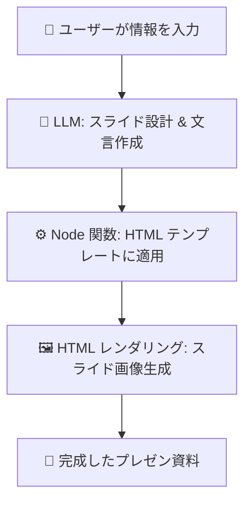

# 📖 mulmo vision とは？

mulmo vision は LLM（大規模言語モデル） を使って、プレゼンテーション資料を自動で作成するツールです。

プログラミングやデザインの専門知識がなくても、
「伝えたい情報」を入力すれば、スライドの文章とデザインが自動生成されます。

# ⚙️ 仕組み

- 情報整理
ユーザーが資料に入れたい情報をまとめます。

- スライド設計（LLM）
LLM が情報を読み取り、必要なスライド構成と文言を決定します。

- HTML テンプレート生成
Node.js 関数が呼ばれ、スライド用の HTML テンプレートに文言が埋め込まれます。

- 画像生成
HTML をレンダリングし、最終的なスライド画像を作成します。





# 技術的な流れ
- LLMがtoolsを使ってスライドの内容を決める
  - [slideを作成するtoolsの関数定義](./src/tools.ts)
- [runner](./src/runner.ts)でtoolsの結果から関数を呼び出す
  - [呼び出される関数](./src/presentationHandlers/html_class.ts)
- [html + tailwindを使ったベースhtml](./assets/templates/tailwind.html) + [スライドごとの個別のhtml](./assets/html/) でhtmlページをつくる
- outdirに画像として保存する


### sample: 80このサンプルデータを使ってhtml -> imageを生成する

```
yarn run generate_all_images
```
- [その関数で生成される80種類のサンプルのデータ](./tests/ai_referencing_80_tool_calls.ts)

outdir/{timeStamp}/{index}.png に画像生成


### openaiのエージェントでprompt -> tools -> html作成

```
yarn run ai
```

プロンプトはソースに直接書いている `src/presentation.ts`


### プラグイン＋デザインテンプレート

デザインは
- toolsから呼ばれる関数群を変更する(html以外でも書き出せる)
- htmlのベースファイルに変更、もしくはstyleの追加
  - assets/templates以下のファイルを書き換える
  - templateファイルの指定
    - `const handler = new htmlPlugin({ outputDir, rootDir, templateOptions: {htmlTemplateFile: "tailwind-sea"}});`
  - templateのheaderへstyleを注入
    - `const handler = new htmlPlugin({ outputDir, rootDir, templateOptions: {headerStyle: darkStyle}});`
- 各スライド用の個別のhtmlファイルの変更
  - `assets/html/` 以下のファイルを編集
  - 各スライド用のフォルダーを変更する
    `const templateFileName = path.resolve(this.rootDir, "./assets/html/", `${fileName}.html`);`

することでカスタマイズできます。


### mcp

buildする
```
yarn run build
```

mcp設定
```
    "mulmocast-vision": {
      "command": "env",
      "args": [
        "node",
        "/path/to/mulmocast-vision/lib/mcp/server.js"
      ],
      "transport": {
        "stdio": true
      }
    }
```

mulmocast-vision/output以下に画像が出力される。
セッションごとにfolderができるので注意
(連続すると画像が上書きされるかも)