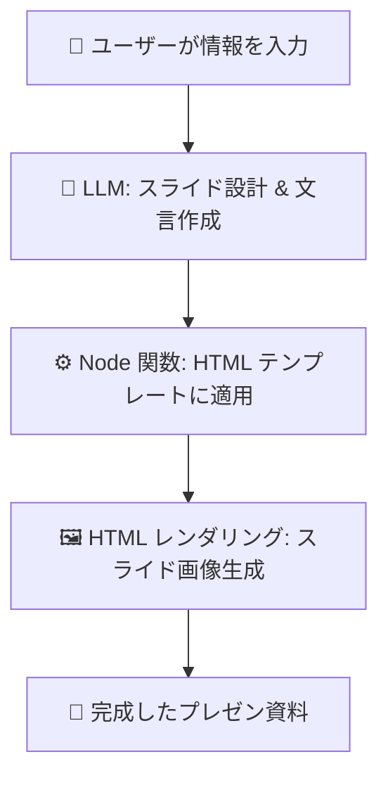

# 📖 mulmo vision とは？

mulmo vision は LLM（大規模言語モデル） を使って、プレゼンテーション資料を自動で作成するツールです。

プログラミングやデザインの専門知識がなくても、
「伝えたい情報」を入力すれば、スライドの文章とデザインが自動生成されます。

# ⚙️ 仕組み

- 情報整理
ユーザーが資料に入れたい情報をまとめます。

- スライド設計（LLM）
LLM が情報を読み取り、必要なスライド構成と文言を決定します。

- HTML テンプレート生成
Node.js 関数が呼ばれ、スライド用の HTML テンプレートに文言が埋め込まれます。

- 画像生成
HTML をレンダリングし、最終的なスライド画像を作成します。




# 技術的なリンク

- [slideを作成するtoolsの関数定義](./src/tools.ts)
- [その関数で生成される80種類のサンプルのデータ](./tests/ai_referencing_80_tool_calls.ts)
- [htmlのテンプレート](assets/html/)


### 80このサンプルデータを使ってhtml -> imageを生成する

```
yarn run generate_all_images
```

outdir/{timeStamp}/{index}.png に画像生成


### openaiのエージェントでprompt -> tools -> html作成

```
yarn run ai
```

プロンプトはソースに直接書いている `src/presentation.ts`


### プラグイン＋デザインテンプレート

デザインは
- toolsから呼ばれる関数群を変更する(html以外でも書き出せる)
- htmlのベースファイルに変更、もしくはstyleの追加
- 各スライド用の個別のhtmlファイルの変更
することでカスタマイズできます。

